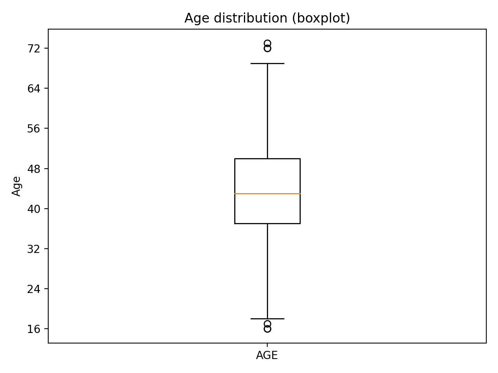
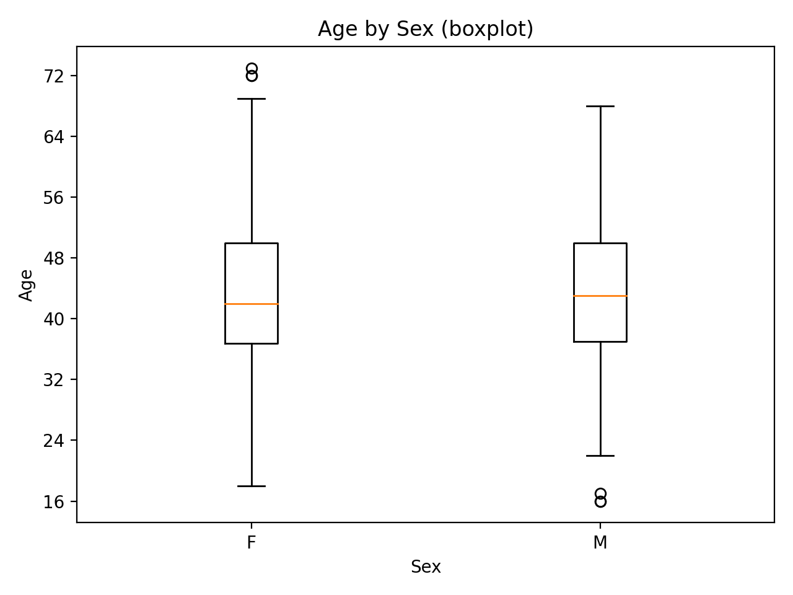
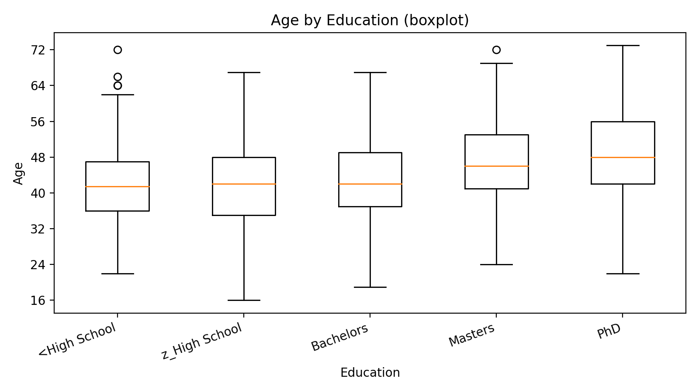
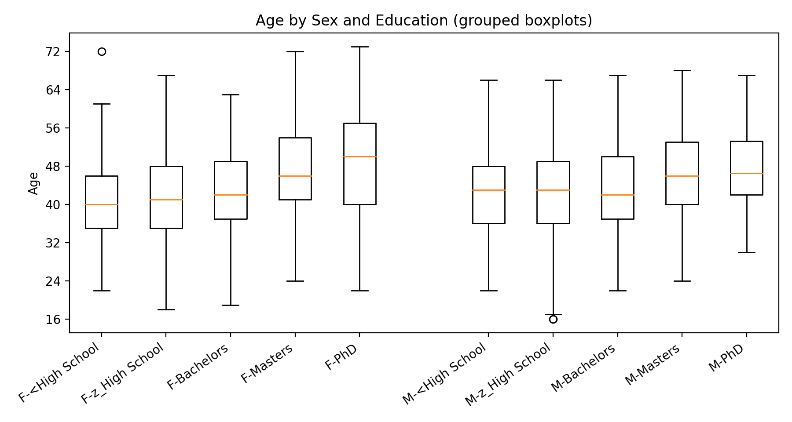

# 🚗 Red Car Ownership Analysis (R)

## Overview
This project explores whether **red car ownership** varies across **age groups**, using a small set of demographic variables. The workflow covers:
- Data loading and feature selection  
- Cleaning and recoding categorical variables  
- Creating age buckets  
- Producing grouped summary outputs  
- Exploratory visualisations (age distributions across groups)

---

## Dataset
**Input:** `data.csv` (anonymised insurance/policyholder dataset)

### Variables used
- `AGE` — policyholder age  
- `MSTATUS` — marital status  
- `SEX` — sex  
- `EDUCATION` — education level  
- `RED_CAR` — whether the car is red (`yes`/`no`)

---

## Repository structure
```
.
├── analysis.R
├── original_script.R
├── data.csv
├── output.csv
└── images
    ├── 01_age_boxplot.png
    ├── 02_age_by_sex_boxplot.png
    ├── 03_age_by_education_boxplot.png
    └── 04_age_by_sex_and_education_boxplots.png
```

---

## How to run
1. Open `analysis.R` in RStudio
2. Set your working directory to the repository root
3. Run the script end-to-end

Outputs:
- `output.csv` (age-group summary including red car percentage)
- Plots saved into `/images`

---

## Outputs

### Grouped summary table
The script creates an age-group summary table with:
- Total cars per age group
- Count of red cars
- Count of married policyholders
- Percentage of red cars per age group

Saved as: `output.csv`

---

## Visualisations

### 1) Age distribution


### 2) Age by sex


### 3) Age by education


### 4) Age by sex and education (grouped)


> Note: These plots focus on **age distributions** for data understanding/quality checks.  
> Differences in **red car ownership** are most clearly seen in the **aggregated table** (`output.csv`).

---

## Next improvements
- Add a chart of **red car percentage by age group**
- Test statistical association (e.g. chi-square for `RED_CAR` vs `agegroup`)
- Improve education ordering/labels for presentation

---

## Author
Made by Myetchae https://www.linkedin.com/in/myetchae/
